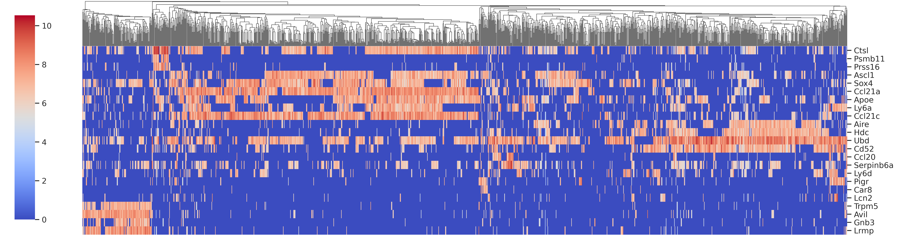
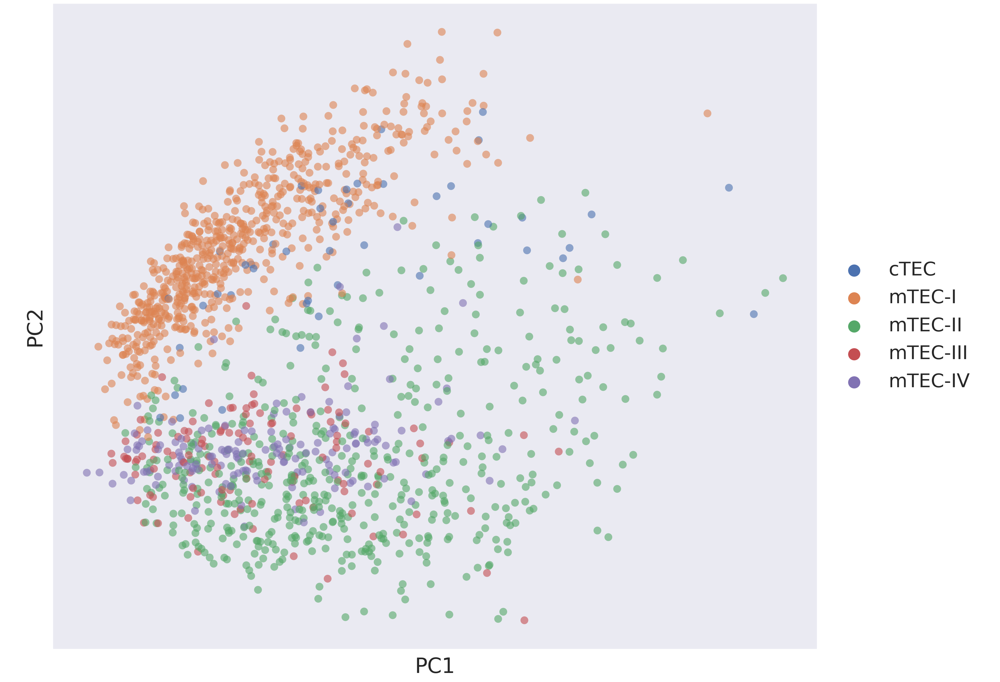
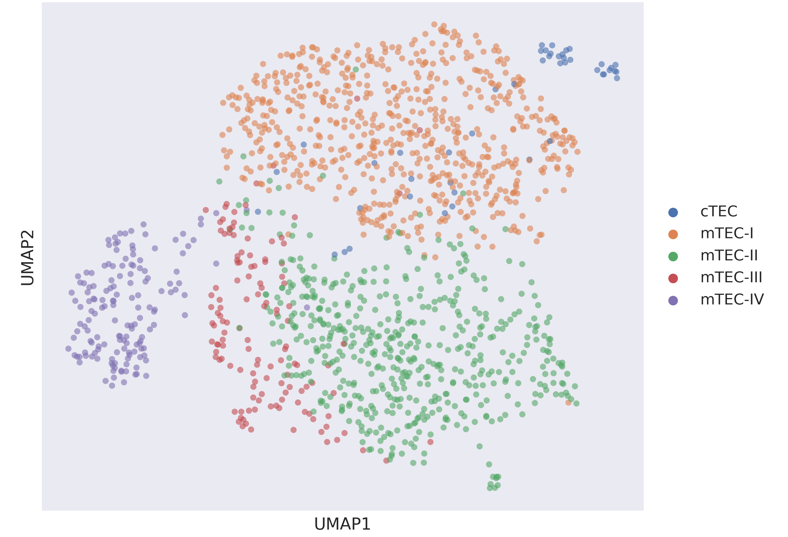
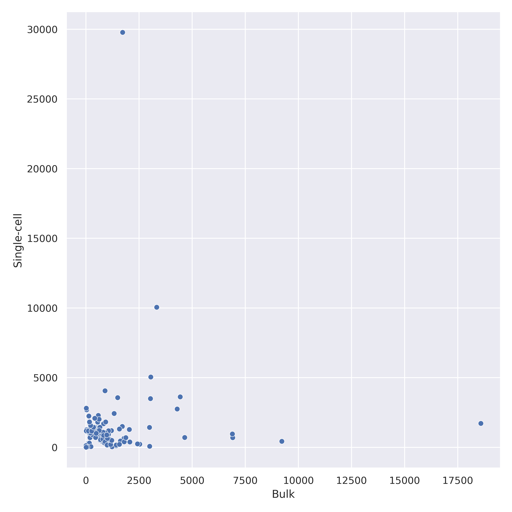
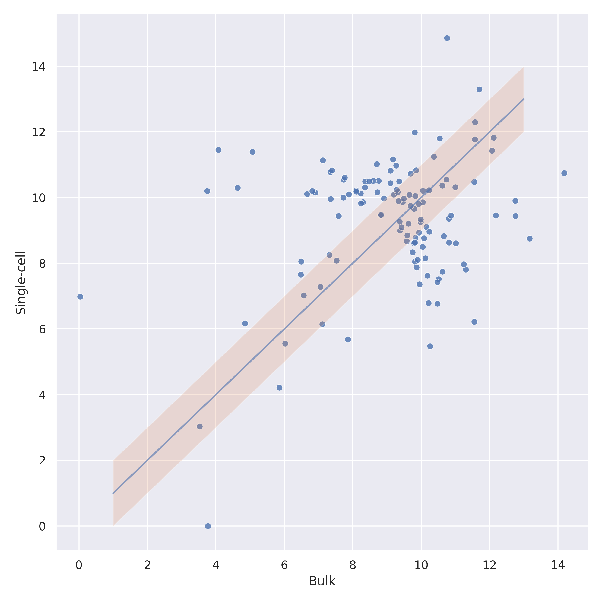

# [Jupyter Notebook](https://colab.research.google.com/drive/1JaIWkQdvA6iaZ5GEtWF9wibKOb0v5-pX?usp=sharing)

## Обязательная часть

### Нормализация данных
* Для корректного сравнения экспрессии одного гена между двумя образцами нужно учитывать, что различия в экспрессии могут быть обусловлены не дифференциальной экспрессией генов, а в целом более интенсивной экспрессией генов в одной клетке по сравнению с другой. Чтобы избавиться от такого эффекта, делят величины экспрессий на суммарное число чтений в образце и умножают на миллион - получают значение RPM (Reads per million).  
* Для корректного сравнения экспрессии двух генов внутри одного образца необходимо учесть тот факт, что при равной экспрессии на длинные гены приходится больше чтений, чем на короткие. Чтобы это нивелировать, делят число ридов, приходящихся на ген, на его длину и умножают на тысячу - получают значение RPK (reads per kilobase).  
* Идеально было бы получить значения RPKM (Reads per kilobase per million) или TPM (Transcripts per million). Оба метода сочетают в себе два предыдущих способа нормализации, отличается лишь порядок действий. Проблема в том, что для TPM и RPKM требуется дополнительная информация о длинах генов.  

Поскольку дополнительного файла с длинами генов у нас нет, получим значения RPM: 
``` python3
data_normalized = counts / counts.sum() * 10**6
```

### Heatmap для экспрессии маркерных генов


### Визуализации с использованием методов уменьшения размерности
PCA | UMAP
-|-
|

## Бонусная часть

Counts | log2(Counts)
-|-
|

1. Нормируем данные bulk RNA-Seq - получаем RPM
2. Высчитываем средние экспрессии для bulk и single-cell (только mTEC-IV) секвенирования.
3. Отбираем топ-100 генов с максимальной средней экспрессией (и экспрессией > 100 по bulk и single-cell).
4. Добавляем к этим 100 генам ещё и маркерные гены (кроме Ccl21c, которого нет в bulk).
5. Отобразим экспрессии этих генов на графике. Выбросы не позволяют адекватно изучить график, поэтому модифицируем данные.
6. Логарифмируем (log2) величины экспрессии и снова построим график, который теперь выглядит намного лучше.
7. Добавим область, включающую гены, экспрессия которых отличается не более чем в 2 раза при разных способах секвенирования 
8. Также подсчитаем, сколько таких генов: 41/121 - отличие меньше чем в 2 раза, 78/121 - отличие меньше чем в 4 раза.